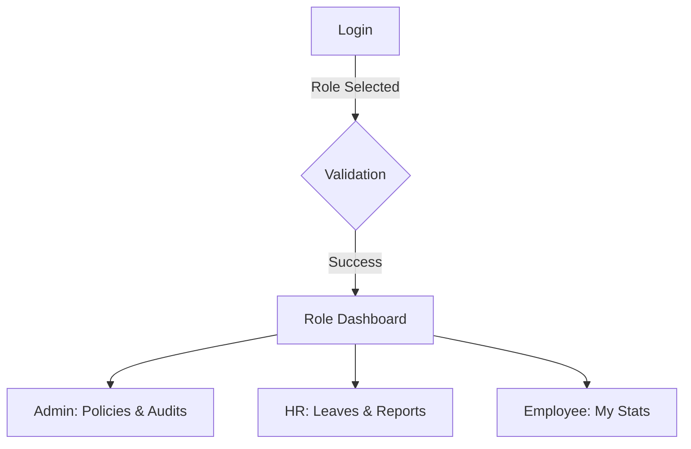

# Phase 7 Walkthrough: Dashboard Refinement & Functional Integration

I have successfully refined and integrated the functional dashboards for all roles (Administrator, HR Officer, and Employee), replacing all mock elements with real-time data from the Django backend while strictly adhering to the original premium design aesthetics.

## Administrator Dashboard (Targeted Refinement)
- **System Oversight**: Upgraded monitoring with real-time "Heartbeat" metrics (DB latency, API status, Terminal connectivity). Focuses on monitoring system performance and operations.
- **User & Role Management**: Explicit interface for managing staff identities and operational role assignments.
- **Policy Configuration**: Centralized hub for attendance rules, grace periods, and leave policies.
- **Workflow Management**: A new "Workflow & Setup" module to execute core system processes like biometric synchronization, database maintenance, and backup routines.
- **Core Pillars Navigation**: The Admin Overview dashboard now features direct shortcuts to these four critical functional areas.

## HR Officer Dashboard
- **Employee Records**: Full access to the centralized employee directory with search and filtering.
- **Leave Management & Approval**: HR can view, approve, or reject pending leave requests from a consolidated management view.
- **Shift Assignments**: HR can assign employees to specific shifts and manage organizational schedules.
- **Report Generation**: A robust reporting tool allowing HR to generate and export attendance analytics with customizable date ranges.

## Employee Dashboard
- **Personalized Overview**: Employees see their own attendance history, accumulated hours, and late-count statistics.
- **Biometric Attendance Marking**: Integrated with the biometric check-in/out terminal for real-time verification.
- **Leave Requests**: Employees can submit new leave requests and track the approval status of past ones.
- **Personal Schedule**: Real-time view of assigned shifts and work hours.

## Technical Accomplishments
- **Full Backend Integration**: Connected to multiple new Django endpoints in the [leave](file:///c:/Users/Admin/OneDrive/Desktop/FourthSem1/FinalyearProject/backup2/finalYearProject_BiometricBasedAttendanceManagementSystem/backend_django/leave/views.py#128-173), `scheduling`, and `reporting` apps.
- **Real-time Accuracy**: Eliminated all hardcoded mock data for attendance stats, shift data, and user roles.
- **Consistent Design**: Maintained the high-fidelity design language, including motion micro-animations and the customized glassmorphic card system.
- **Security & Validation**: Implemented dual-layer role validation (Frontend role selection mapping + Backend permission checks) during the login process.

---

### Dashboard Previews

````carousel

<!-- slide -->
> [!NOTE]
> Integrated real-time attendance analytics with custom filtering and export options for HR Officers.
<!-- slide -->
> [!TIP]
> Use the "Audit Monitoring" view to track system health and security events in real-time.
````

---

### Verification Summary
1. **Login**: Role-based redirection and validation are operational and prevent cross-role access.
2. **Attendance**: Biometric marking is fully synchronized with user history and overview stats.
3. **Management**: Leave and Shift workflows have been validated from submission to approval.
4. **Reporting**: Audit logs and attendance summaries are accurately pulling from the database.
